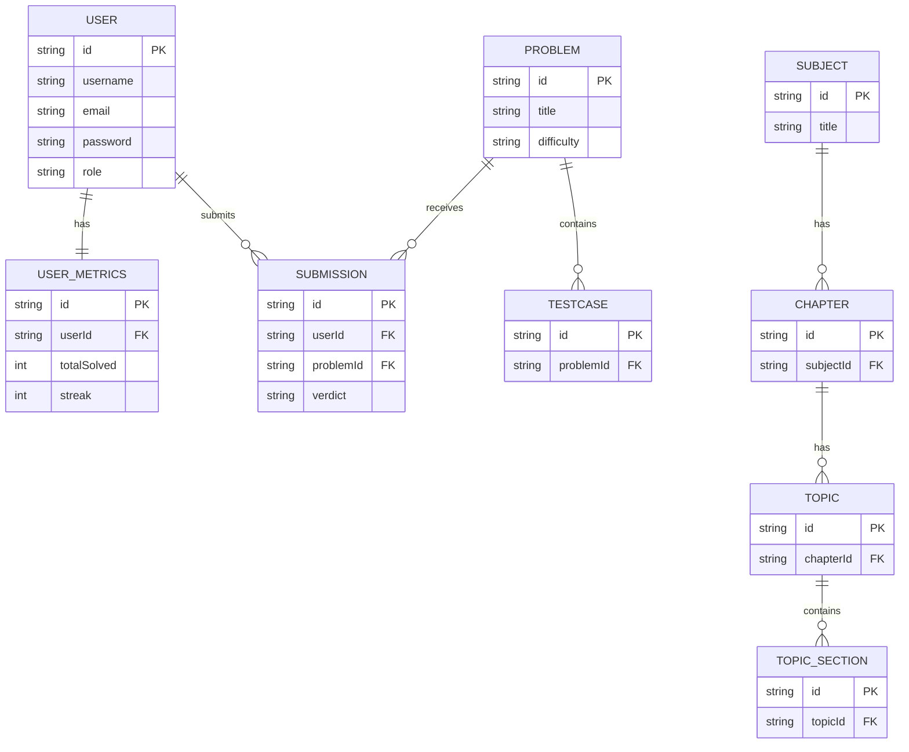

# CoderRoute ER Diagram

```mermaid
erDiagram
USER {
    string id PK
    string username
    string email
    string password
    string role
}
USER_METRICS {
    string id PK
    string userId FK
    int totalSolved
    int streak
}
PROBLEM {
    string id PK
    string title
    string difficulty
}
SUBMISSION {
    string id PK
    string userId FK
    string problemId FK
    string verdict
}
TESTCASE {
    string id PK
    string problemId FK
}
SUBJECT {
    string id PK
    string title
}
CHAPTER {
    string id PK
    string subjectId FK
}
TOPIC {
    string id PK
    string chapterId FK
}
TOPIC_SECTION {
    string id PK
    string topicId FK
}
USER ||--o{ SUBMISSION : submits
PROBLEM ||--o{ SUBMISSION : receives
PROBLEM ||--o{ TESTCASE : contains
USER ||--|| USER_METRICS : has
SUBJECT ||--o{ CHAPTER : has
CHAPTER ||--o{ TOPIC : has
TOPIC ||--o{ TOPIC_SECTION : contains
```
